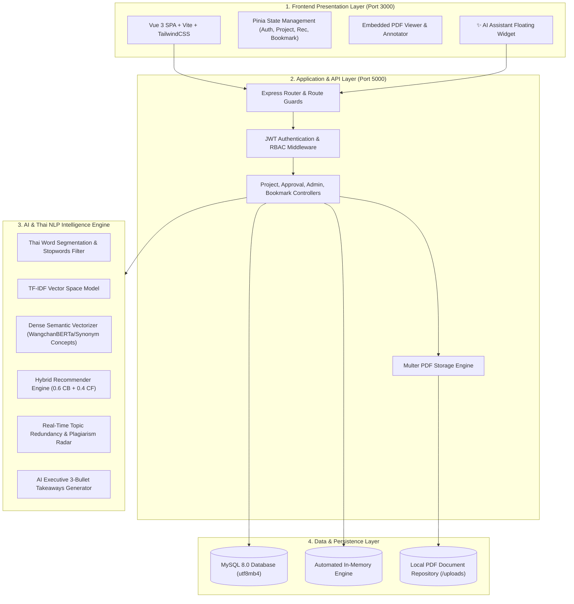
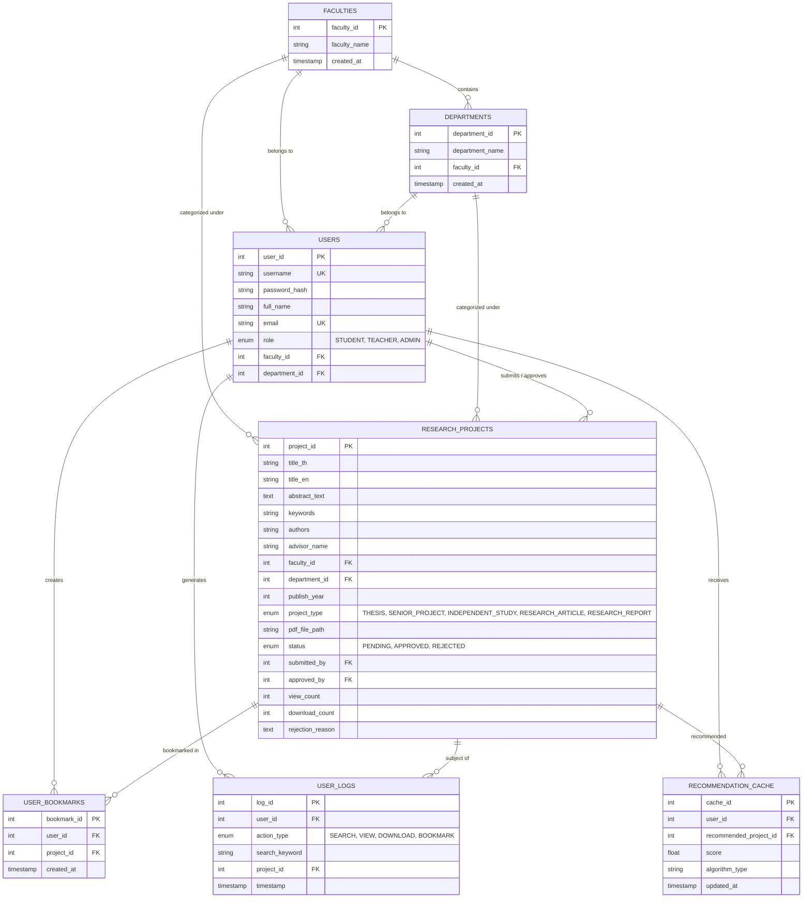

# รายงานสถาปัตยกรรมระบบ (System Architecture Guide)
## เว็บแอปพลิเคชันคลังรวมและเผยแพร่โครงงานวิจัยบัณฑิตศึกษาและโปรเจกต์จบ มหาวิทยาลัยราชภัฏสุรินทร์ (SRRU)

---

## 1. ภาพรวมสถาปัตยกรรมระบบ (System Architecture Overview)

ระบบถูกออกแบบด้วยสถาปัตยกรรมแบบ **Decoupled Client-Server & AI Micro-Engine Architecture** เพื่อรองรับความเร็ว ความปลอดภัย และความยืดหยุ่นในการประมวลผลโมเดลภาษาธรรมชาติภาษาไทย (Thai NLP)

---

## 2. โครงสร้างฐานข้อมูล E-R Diagram (Database Schema)

ระบบประกอบด้วย 7 ตารางหลักที่เชื่อมโยงกันอย่างสมบูรณ์:

---

## 3. หลักการทำงานของอัลกอริทึมปัญญาประดิษฐ์ (AI & Thai NLP Mathematical Models)

### 3.1 การประมวลผลข้อความภาษาไทย (Thai NLP & TF-IDF)
1. **การตัดคำและกำจัดคำหยุด (Tokenization & Stopwords Removal)**:
   ข้อความภาษาไทยจะถูกทำความสะอาดและตัดคำผ่านพจนานุกรมคำศัพท์วิชาการภาษาไทย และกรองคำที่ไม่สื่อความหมาย (Stopwords) ออก
2. **การแปลงข้อความเป็นเวกเตอร์ (Vector Space Model)**:
   $$\text{TF}(t, d) = \frac{f_{t, d}}{\sum_{t' \in d} f_{t', d}}$$
   $$\text{IDF}(t, D) = \ln\left(\frac{1 + |D|}{1 + |\{d \in D : t \in d\}|}\right) + 1$$
   $$\text{TF-IDF}(t, d, D) = \text{TF}(t, d) \times \text{IDF}(t, D)$$

### 3.2 การสืบค้นเชิงความหมาย (Dense Semantic Vector Search)
ระบบแมปคำศัพท์เข้าสู่แนวคิดทางความหมาย (Semantic Concept Clusters) เช่น *AI, Machine Learning, Deep Learning, CNN, Thai NLP, ข้าวหอมมะลิ, ผ้าไหมสุรินทร์, IoT, GIS* เพื่อให้คำนวณ Cosine Similarity ได้แม้ใช้คำคนละคำ:
$$\text{Similarity}(A, B) = \frac{A \cdot B}{\|A\| \|B\|} = \frac{\sum_{i=1}^n A_i B_i}{\sqrt{\sum_{i=1}^n A_i^2} \sqrt{\sum_{i=1}^n B_i^2}}$$

### 3.3 ระบบแนะนำแบบผสมผสาน (Hybrid Recommendation Formula)
$$\text{Score}_{\text{Hybrid}}(u, p) = 0.6 \times \text{Score}_{\text{CB}}(u, p) + 0.4 \times \text{Score}_{\text{CF}}(u, p)$$
* **Content-Based Filtering (CB - 60%)**: วิเคราะห์ความคล้ายคลึงระหว่างบทคัดย่อของผลงานในคลังกับงานที่ผู้ใช้เคยเปิดอ่าน/บุ๊กมาร์ก
* **Collaborative Filtering (CF - 40%)**: วิเคราะห์พฤติกรรมร่วมจาก User Interaction Logs โดยกำหนดค่าน้ำหนัก:
  - $\text{Bookmark} = 3.0$
  - $\text{Download} = 2.0$
  - $\text{View} = 1.0$

---

## 4. เมทริกซ์สิทธิ์การใช้งาน (Role-Based Access Control - RBAC)

| ความสามารถ / หน้าจอ | บุคคลทั่วไป (Guest) | นักศึกษา (STUDENT) | อาจารย์ (TEACHER) | ผู้ดูแลระบบ (ADMIN) |
| :--- | :---: | :---: | :---: | :---: |
| สืบค้นงานวิจัย / ค้นหา Semantic AI | ✅ | ✅ | ✅ | ✅ |
| เปิดอ่านเอกสาร PDF ฉบับเต็ม | ✅ | ✅ | ✅ | ✅ |
| ส่งออกไฟล์บรรณานุกรม (.RIS / .BIB) | ✅ | ✅ | ✅ | ✅ |
| ใช้งาน AI Chatbot ผู้ช่วยวิจัย | ✅ | ✅ | ✅ | ✅ |
| บันทึกงานวิจัย (Bookmarks) | ❌ | ✅ | ✅ | ✅ |
| ส่งผลงานวิจัยใหม่ & ตรวจซ้ำซ้อน | ❌ | ✅ | ❌ | ✅ |
| ตรวจอนุมัติ & คอมเมนต์ PDF (Annotation) | ❌ | ❌ | ✅ | ✅ |
| แดชบอร์ดสถิติ KPI และจัดการผู้ใช้งาน | ❌ | ❌ | ❌ | ✅ |
